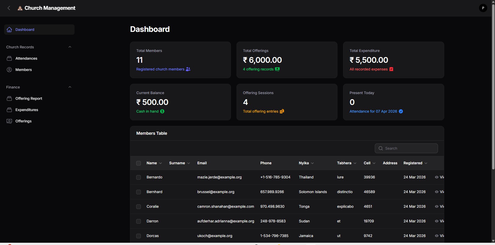
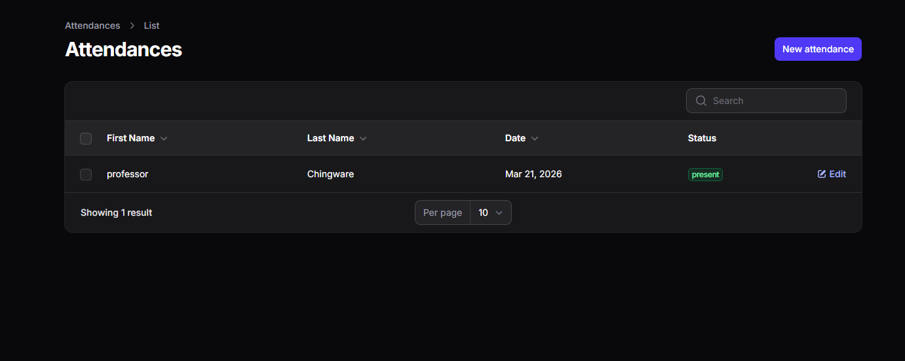
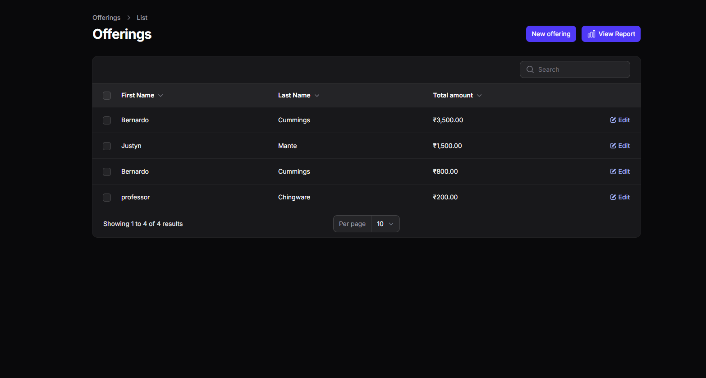
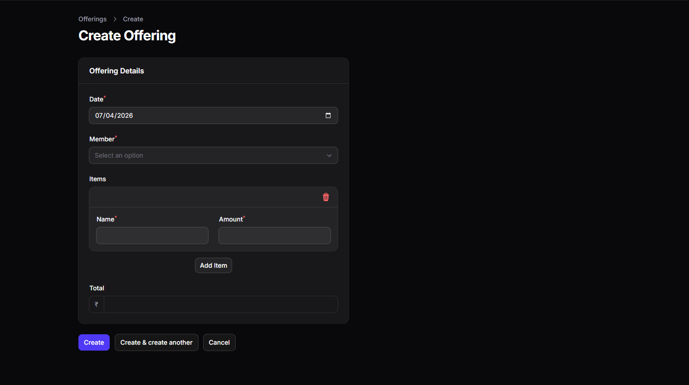
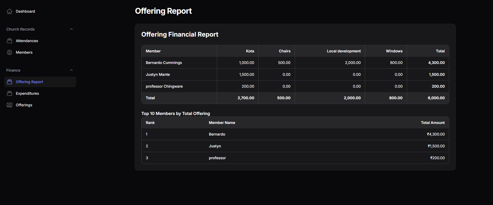

# Church Management System

A Laravel-based church management system built with Filament admin panel for managing church members, offerings, expenditures, and attendance.

---

## Table of Contents

1. [System Overview](#system-overview)
2. [Technology Stack](#technology-stack)
3. [Features](#features)
4. [Navigation Structure](#navigation-structure)
5. [Pages & Resources](#pages--resources)
6. [Database Models](#database-models)
7. [Installation](#installation)
8. [Usage Guide](#usage-guide)

---

## System Overview

This application is designed to help churches manage their financial records, member information, and attendance tracking. It provides a comprehensive dashboard for viewing key metrics and detailed reports for analysis.

---

## Technology Stack

- **Backend**: Laravel 12
- **Admin Panel**: Filament 4.x
- **Database**: MySQL
- **Frontend**: Tailwind CSS
- **PHP**: 8.2+

---

## Features

### Church Records
- Member management (add, edit, view, delete)
- Attendance tracking per service date

### Finance Management
- Offering recording with multiple offering types (tithing, general, chairs, windows, etc.)
- Expenditure tracking with automatic balance calculation
- Financial reports and analysis

### Reporting
- Offering Financial Report
- Consolidated Reports (monthly summaries, top contributors)

---

## Navigation Structure

The application has two main navigation groups:

### Church Records
- **Members** - Manage church member information
- **Attendance** - Track attendance per service

### Finance
- **Offerings** - Record and manage offerings
- **Expenditures** - Track church expenses
- **Offering Report** - Detailed offering financial report
- **Consolidated Reports** - Overview with stats and monthly summaries

---

## Pages & Resources

### Dashboard

The main dashboard provides an overview of key church metrics including:
- Total members
- Total offerings
- Total expenditures
- Current balance
- Present today (attendance)
- Recent members table



---

### Church Records Group

#### Members Resource

Manage church member information with the following fields:
- Name
- Last Name  
- Email
- Phone
- Cell Group
- Nyika Area
- Tabhera Area
- Address
- Created Date

Features:
- List view with search and sort
- Create new member form
- View member details
- Edit member information
- Delete member


#### Attendance Resource

Track service attendance with fields:
- Date
- Service Type (Morning Service, Bible Study, etc.)
- Actual Count
- Status (Present, Absent)

Features:
- Calendar-based date selection
- Service type filtering
- Attendance status tracking



---

### Finance Group

#### Offerings Resource

Record member offerings with:
- Date
- Member selection
- Multiple offering items (type and amount)
- Auto-calculated total

Supporting model:
- **OfferingItem** - Individual offering entries per offering




#### Expenditures Resource

Track church expenses with:
- Date
- Details/Description
- Amount
- Auto-calculated Income and Balance

Features:
- Automatic income calculation (Total Offerings - Previous Expenditures)
- Running balance tracking
- Recalculation on updates


---

### Reports Pages

#### Offering Report

Comprehensive offering report showing:
1. **Member Offerings Table** - Breakdown by member and offering type
2. **Top 10 Members** - Highest contributing members
3. **Monthly Financials** - Monthly expenditure vs offering income comparison




## Database Models

### User (Member)

```php
class User extends Model
{
    // Fields: name, last_name, email, phone, 
    //         cell, nyika, tabhera, address
}
```

### Offering

```php
class Offering extends Model
{
    // Fields: user_id, date, total_amount
    // Relationships: user, items (hasMany OfferingItem)
}
```

### OfferingItem

```php
class OfferingItem extends Model
{
    // Fields: offering_id, type, amount
    // Relationships: offering (belongsTo)
}
```

### Expenditure

```php
class Expenditure extends Model
{
    // Fields: date, details, amount, income, balance
    // Features: Auto-calculation of income/balance
    // Methods: recalculateAll()
}
```

### Attendance

```php
class Attendance extends Model
{
    // Fields: date, service_type, actual_count, status
}
```

---

## Installation

### Prerequisites
- PHP 8.2+
- Composer
- Node.js & NPM

### Steps

1. **Install dependencies**
   ```bash
   composer install
   npm install
   ```

2. **Setup environment**
   ```bash
   cp .env.example .env
   php artisan key:generate
   ```

3. **Run migrations**
   ```bash
   php artisan migrate
   ```

4. **Build assets**
   ```bash
   npm run build
   ```

5. **Start development server**
   ```bash
   php artisan serve
   ```

6. **Access admin panel**
   - URL: `http://localhost:8000/admin`
   - Login with your credentials

---

## Usage Guide

### Recording an Offering

1. Navigate to **Finance > Offerings**
2. Click **New Offering**
3. Select the member
4. Choose the date
5. Add offering items with types and amounts
6. Save

### Recording an Expenditure

1. Navigate to **Finance > Expenditures**
2. Click **New Expenditure**
3. Enter the date
4. Provide description/details
5. Enter the amount
6. Save (income and balance auto-calculate)

### Viewing Reports

1. **Offering Report**: Finance > Offering Report
   - View by member and type
   - See top contributors
   - Compare monthly income vs expenditure


## Support

For issues or questions, please open an issue on the project repository.

---

## License

MIT License
